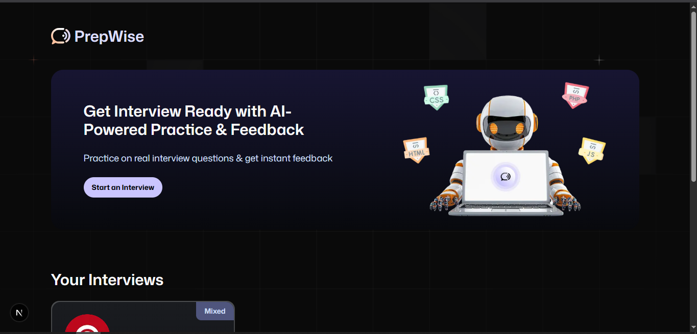

# PrepWise 🚀

An AI-powered platform for preparing interviews, built with Next.js and Firebase.



## ✨ Features

- 🤖 **AI-Powered Practice** - Train with real interview questions
- 💬 **Instant Feedback** - Get immediate analysis of your responses
- 🔥 **Firebase Integration** - Secure authentication and data storage
- 📱 **Responsive Design** - Works on all devices
- 🌙 **Dark Mode** - Modern UI with theme support
- 🛠️ **TypeScript** - Type-safe codebase for reliability

## 🛠️ Tech Stack

- **Frontend**: [Next.js 15](https://nextjs.org/) with App Router and React 19
- **Styling**: [Tailwind CSS](https://tailwindcss.com/) with customized theme
- **Authentication**: Firebase Authentication
- **Database**: Firebase Database
- **AI Integration**: AI SDK for interview preparation
- **UI Components**: Custom UI with shadcn/ui components
- **Form Handling**: React Hook Form with Zod validation

## 🚀 Getting Started

### Prerequisites

- Node.js 18+
- npm or yarn

### Installation

1. Clone the repository

   ```bash
   git clone https://github.com/paulustimothy/ai-interviews.git
   cd ai-interviews
   ```

2. Install dependencies

   ```bash
   npm install
   # or
   yarn
   ```

3. Create a `.env.local` file with your Firebase credentials

   ```
   FIREBASE_PROJECT_ID=
   FIREBASE_PRIVATE_KEY=
   FIREBASE_CLIENT_EMAIL=
   
   GOOGLE_GENERATIVE_AI_API_KEY=

   NEXT_PUBLIC_VAPI_WEB_TOKEN= (#PUBLIC_KEY)
   NEXT_PUBLIC_VAPI_WORKFLOW_ID_IND=
   NEXT_PUBLIC_VAPI_WORKFLOW_ID=

   NEXT_PUBLIC_BASE_URL=
   ```

4. Start the development server

   ```bash
   npm run dev
   # or
   yarn dev
   ```

5. Open [http://localhost:3000](http://localhost:3000) in your browser

## 🙏 Acknowledgments

- [Next.js](https://nextjs.org/) - The React Framework
- [Firebase](https://firebase.google.com/) - Backend services
- [shadcn/ui](https://ui.shadcn.com/) - UI components

Special thanks to JavaScript Mastery
